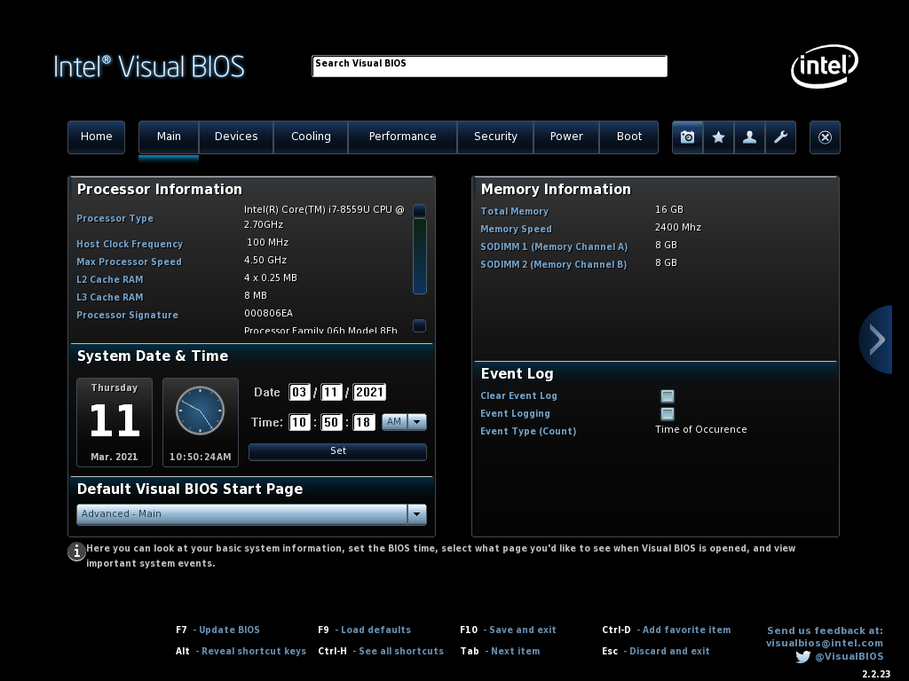
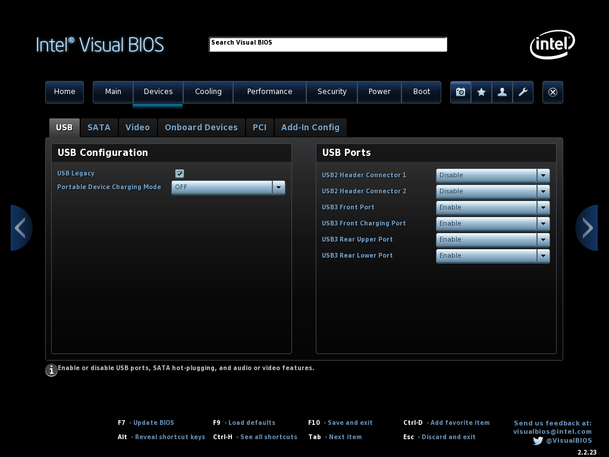
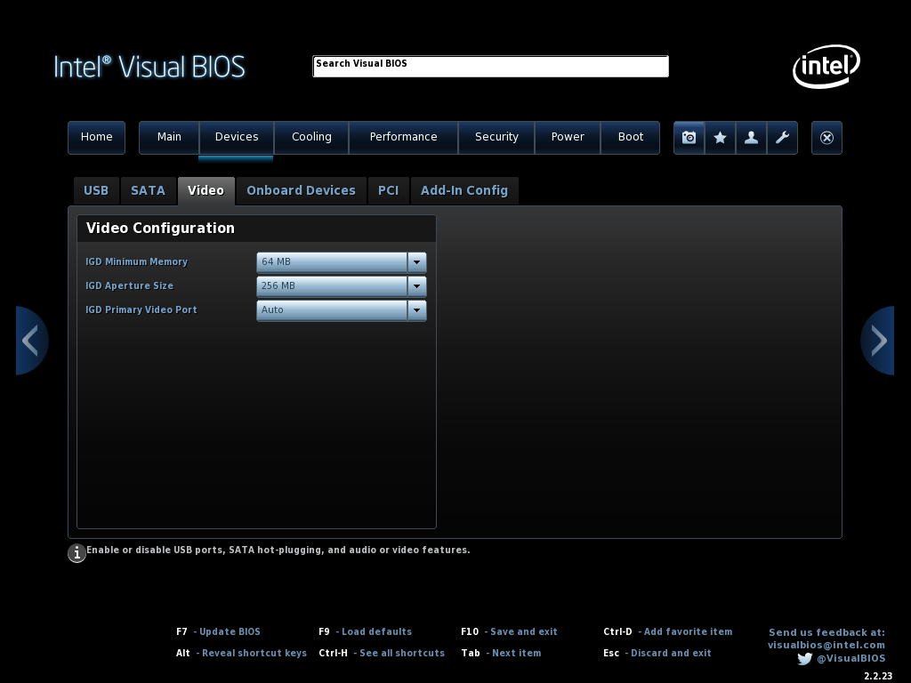
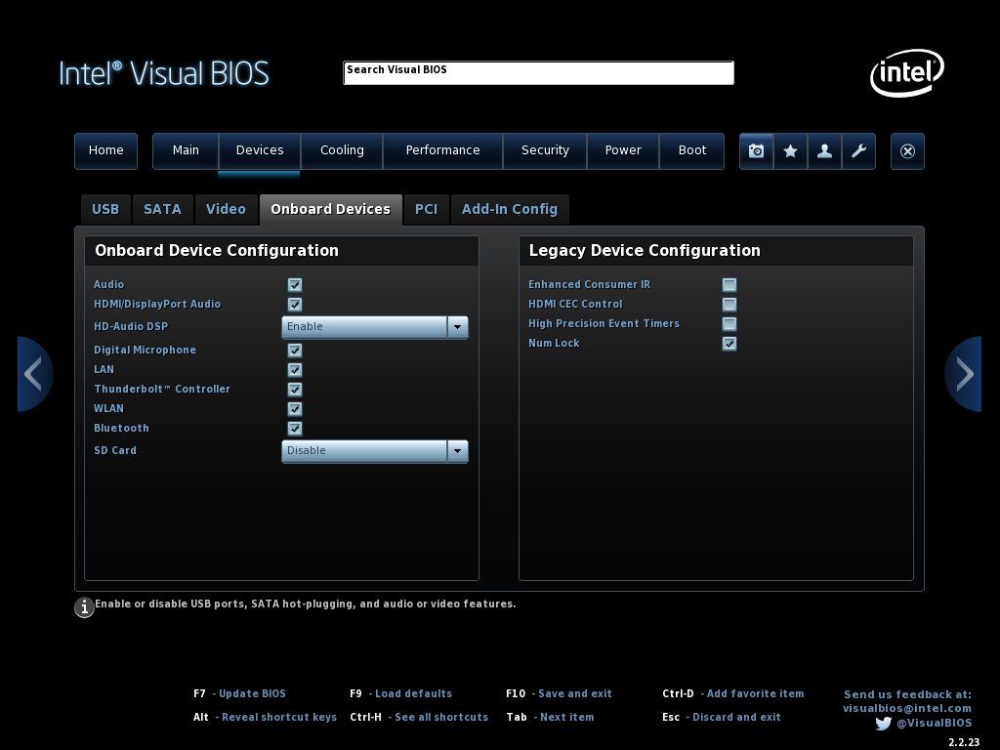
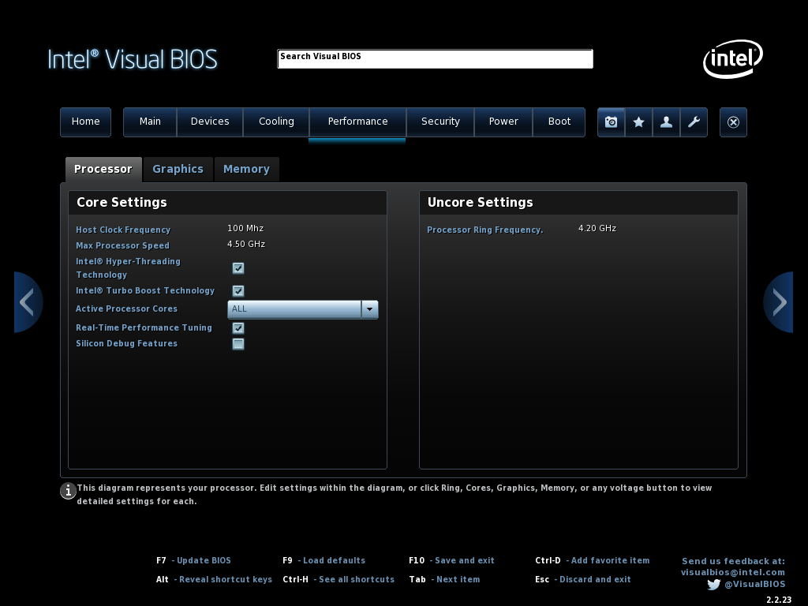
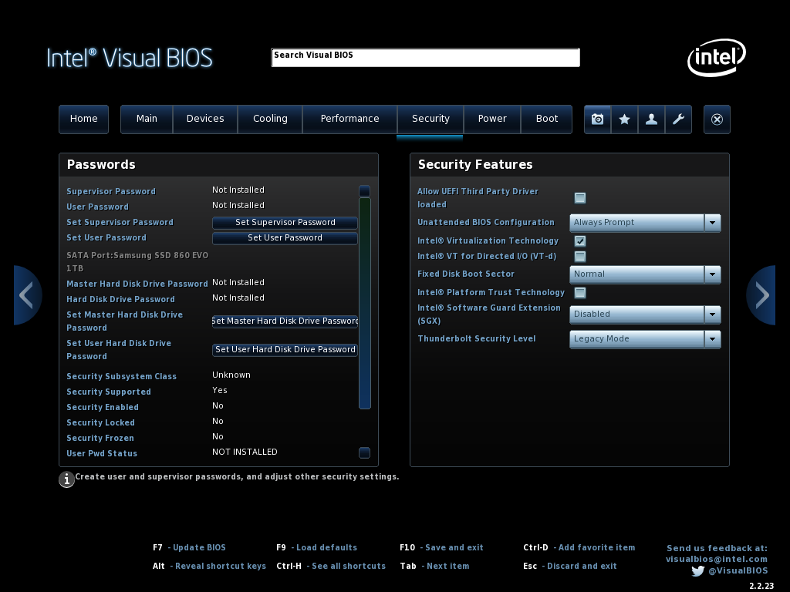
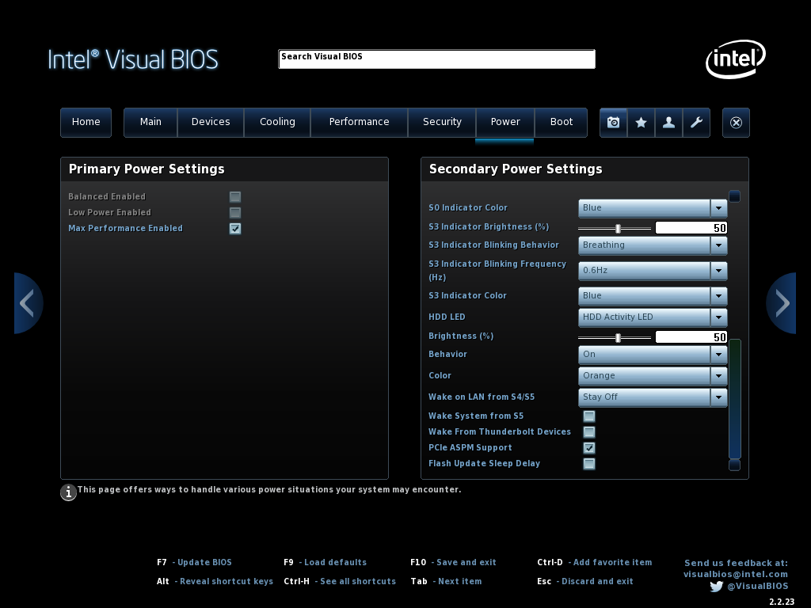
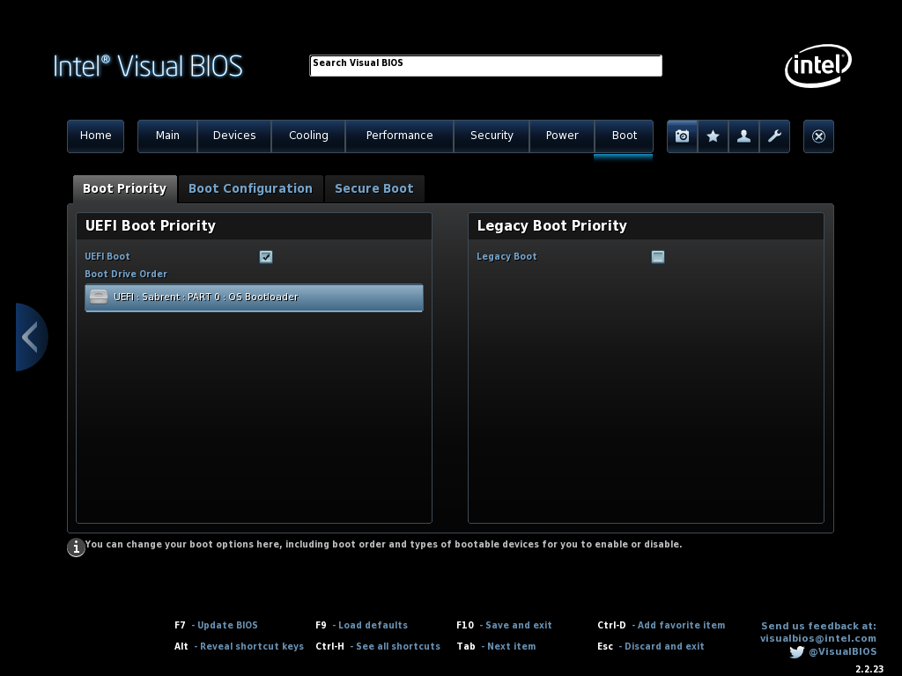
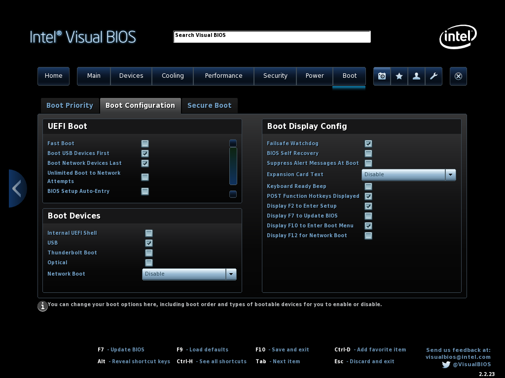
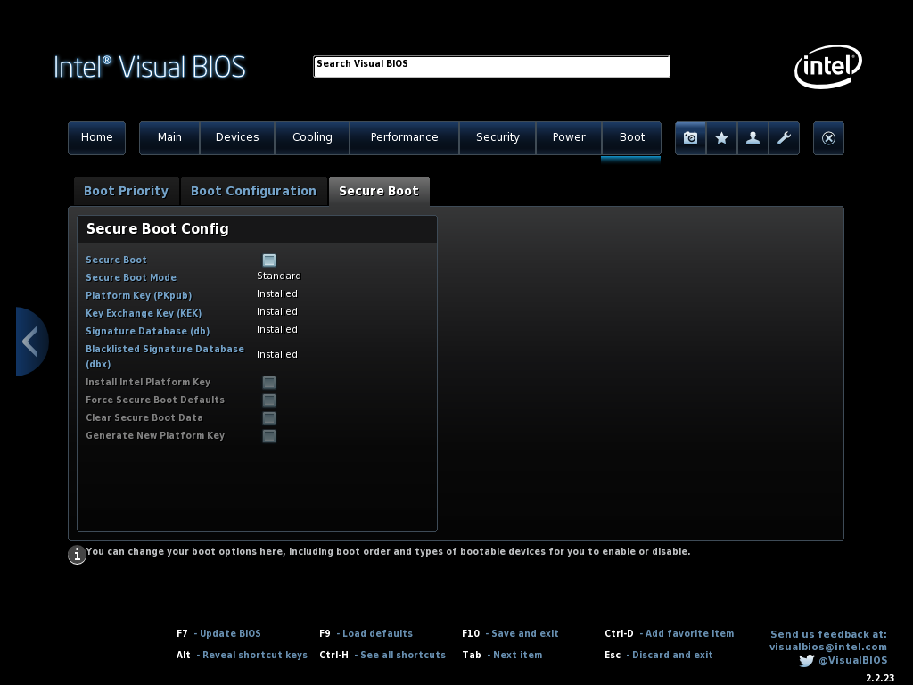

# Required BIOS Settings

There are some basic requirements regarding the BIOS settings of this NUC in order to be able to boot correctly to macOS via the UEFI bootloader. Press F2 to enter Visual BIOS Setup; press F9 to **load defaults;** then click on "Advanced" button and proceed to the following changes below, per section.

## Necessary :warning: and Advised Changes :white_check_mark:

**1. DEVICES Section**
* In "Onboard Devices" section → "Onboard Devices Configuration" panel → Set "SD Card" to **Disabled**  :warning:
* In "USB" section → "USB Configuration" panel → Set "Portable Device Charging Mode" to **"Off"**  :white_check_mark:
* In "USB" section → "USB Ports" panel → Set both "USB2 Header Connector" ports to **Disabled**  :warning:
* In "Video" section → "Video Configuration" panel → Confirm that "IGD Minimum Memory" is set as **64 MB**  :warning:
* In "Video" section → "Video Configuration" panel → Confirm that "IGD Aperture Size" is set to **256 MB**  :warning:
* In "Onboard Devices" section → "Legacy Device Configuration" panel → Set "Enhanced Consumer IR" to **Disabled**  :white_check_mark:
* In "Onboard Devices" section → "Legacy Device Configuration" panel → Set "HDMI CEC Control" to **Disabled**  :white_check_mark:

**2. SECURITY Section**
* In "Security Features" section → Set "Intel VT for Directed I/O (VT-d)" to **Disabled**  :warning:
* In "Security Features" section → Set "Intel Software Guard Extension (SGX)" to **Disabled**  :white_check_mark:
* In "Security Features" section → Set "Thunderbolt Security Level" to **"Legacy Mode"**  :warning:

**3. POWER Section**
* In "Secondary Power Settings" section → Set "Wake on LAN from S4/S5" to **"Stay Off"**  :warning:
* In "Secondary Power Settings" section → Set "PCIe ASPM Support" to **Enabled**  :white_check_mark:

**4. BOOT Section**
* In "Secure Boot" section → "Secure Boot Configuration" panel → Set "Secure Boot" to **Disabled**  :warning:
* In "Boot Priority" section → "UEFI Boot Priority" panel → Confirm that "UEFI Boot" is **Enabled**  :warning:
* In "Boot Configuration" section → "UEFI Boot" panel → Set "Fast Boot" to **Disabled**  :warning:
* In "Boot Configuration" section → "UEFI Boot" panel → Set "Boot USB Devices First" to **Enabled**  :white_check_mark:
* In "Boot Configuration" section → "UEFI Boot" panel → Set "Boot Network Devices Last" to **Enabled**  :white_check_mark:
* In "Boot Configuration" section → "UEFI Boot" panel → Set "Startup Sound" to **Disabled**  :white_check_mark:
* In "Boot Devices" section → "Boot Devices" panel → Set "Thunderbolt Boot" to **Disabled**  :white_check_mark:
* In "Boot Devices" section → "Boot Devices" panel → Set "Optical Boot" to **Disabled**  :white_check_mark:
* In "Boot Devices" section → "Boot Devices" panel → Set "Network Boot" to **Disabled**  :warning:
* In "Boot Devices" section → "Boot Display Configuration" panel → Set "Display F7 to Update BIOS" to **Disabled**  :white_check_mark:

**Press F10 to save and exit.**

**Note:** [ASPM](https://en.wikipedia.org/wiki/Active_State_Power_Management) is a PCI Express enhancement; it allows for a device to go completely into an electrically "idle" state i.e. it will not send or receive electrical signals when entering this state. PCIe cards should always support ASPM and this should normally be handled by BIOS as the OS may _not_ always play an important part.

