# Intel NUC Model NUC8i7BEH

This repository contains personal work and files, developed and maintained for a successful use with [OpenCore EFI bootloader](https://github.com/acidanthera/OpenCorePkg) on this specific Intel NUC model. There are **no** ready, pre-packaged EFI solutions provided; instead, the needed configuration and ACPI files are published for those interested in studying the code, while creating their own bootloader configurations.

${\textsf{\color{red}The project resumes after repairing a hardware fault affecting all USB ports of the NUC motherboard.}}$

**Table Of Contents**
- [Platform Generation](#platform-generation)
- [Product Generation: Bean Canyon (2018)](#product-generation-bean-canyon-2018)
- [Processor Generation: Coffee Lake (2018)](#processor-generation-coffee-lake-2018)
- [Geekbench](#geekbench)
- [Product Overview](#product-overview)
- [Compatible Models](#compatible-models)
- [Current Setup](#current-setup)
- [Required BIOS Settings](#required-bios-settings)
- [Active Configuration](#active-configuration)
- [Intel Iris Plus Graphics 655 Properties](#intel-iris-plus-graphics-655-properties)
- [USB Port Mapping on NUC Chassis](#usb-port-mapping-on-nuc-chassis)
- [CPU Fan Reading Support](#cpu-fan-reading-support)
- [Wireless Connectivity](#wireless-connectivity)
- [CPU Power Management](#cpu-power-management)
- [Changes Brought About by macOS 12 and later](#changes-brought-about-by-macos-12-and-later)

## Platform Generation

* Sandy Bridge = All Core ix-3xxx (HD Graphics 3000)
* Ivy Bridge = All Core ix-3xxx (HD Graphics 4000)
* Haswell = All Core ix-4xxx (HD Graphics 4600)
* Broadwell = All Core ix-5xxx (Iris Pro Graphics 6200)
* Skylake = All Core ix-6xxx (HD Graphics 5xx)
* Kaby Lake = All Core ix-7xxx (UHD/Iris Plus Graphics 6xx)
* **Coffee Lake = All Core ix-8xxx (UHD/Iris Plus Graphics 6xx)**

## Product Generation: Bean Canyon (2018)

**Specifications:** N/A (original Intel websites [here](https://www.intel.com/content/www/us/en/ark/products/126140/intel-nuc-kit-nuc8i7beh.html) and [here](https://www.intel.com/content/www/us/en/products/sku/126140/intel-nuc-kit-nuc8i7beh/specifications.html) no longer exist)

**Downloads:** see [ASUS website](https://www.asus.com/supportonly/nuc8i7beh/helpdesk_download/) as original [Intel website](https://www.intel.co.uk/content/www/uk/en/products/sku/126140/intel-nuc-kit-nuc8i7beh/downloads.html) no longer exists

**BIOS Update & Recovery Instructions:** see [Intel website](https://www.intel.com/content/www/us/en/support/articles/000005636/intel-nuc.html)

## Processor Generation: Coffee Lake (2018)

**CPU:** Intel Core i7-8559U @ 2.70 GHz up to 4.50 GHz / 4 Cores / 8 Threads

**GPU:** Intel Iris Plus Graphics 655 / 300 MHz up to 1.20 GHz

**Specifications:** see [Intel website](https://www.intel.com/content/www/us/en/ark/products/137979/intel-core-i78559u-processor-8m-cache-up-to-4-50-ghz.html)

## Geekbench

**V4 Scores:** https://browser.geekbench.com/v4/cpu/search?q=Core+i7-8559U

**V5 Scores:** https://browser.geekbench.com/v5/cpu/search?q=Core+i7-8559U

**V6 Scores:** https://browser.geekbench.com/v6/cpu/search?q=Core+i7-8559U

## Product Overview

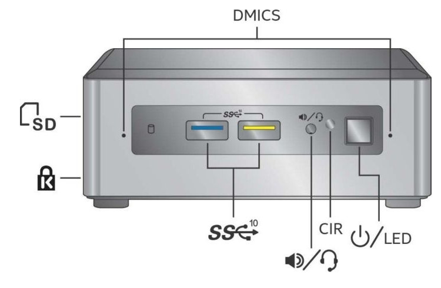

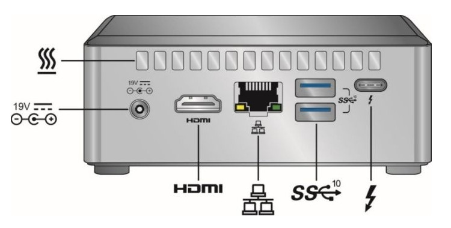

## Compatible Models

Mac Model: iMac16,2 
CPU: i7-5675R @ 3.10 GHz up to 3.60 GHz / 4 Cores / 8 Threads 
GPU: Intel Iris Pro 6200 
Everymac: https://everymac.com/ultimate-mac-lookup/?search_keywords=iMac16,2 
Board ID: FFE5EF870D7BA81A 
BIOS Revision: IM162.88Z.0221.B00.1809171530 

Mac Model: iMac18,1 
CPU: i5-7360U @ 2.30 GHz up to 3.60 GHz / 2 Cores / 4 Threads 
GPU: Iris Plus Graphics 640 
Everymac: https://everymac.com/ultimate-mac-lookup/?search_keywords=iMac18,1 
Board ID: 4B682C642B45593E 
BIOS Revision: IM181.88Z.F000.B00.1809171524

Mac Model: **Macmini8,1** 
CPU: i7-8700B @ 3.20 GHz up to 4.60 GHz / 6 Cores / 12 Threads 
GPU: Intel UHD Graphics 630 
Everymac: https://everymac.com/ultimate-mac-lookup/?search_keywords=Macmini8,1 
Board ID: 7BA5B2DFE22DDD8C 
BIOS Revision: MM81.88Z.F000.B00.1809171422 
BIOS Revision: MM81.88Z.F000.B00.1907261958 
BIOS Revision: MM81.88Z.F000.B00.2001052107 
BIOS Revision: MM81.88Z.F000.B00.2005132145 
BIOS Revision: MM81.88Z.F000.B00.2101062036 
BIOS Revision: MM81.88Z.F000.B00.2105212325 
BIOS Revision: MM81.88Z.F000.B00.2110032010 
BIOS Revision: MM81.88Z.F000.B00.2111162120 

## Current Setup

**Memory:** 16GB in 2 x 8GB SO-DIMM (1.2V) 
**RAM:** Kingston HyperX "Impact" DDR4 @ 2400MHz CL14 (Model HX424S14IB2/8) 
**WLAN:** Intel Dual-Band Wireless-AC 9560 (Embedded Module) [[8086:9df0]](http://pci-ids.ucw.cz/read/PC/8086/9df0) 
**BTLE:** Intel Bluetooth 5.1 (Embedded Module) [8087:0aaa] 
**NVMe:** Sabrent Rocket NVMe M.2 512GB (Model SB-ROCKET-512) [[1987:5012]](https://pci-ids.ucw.cz/read/PC/1987/5012) 
**Previous NVMe:** Samsung EVO 970 NVMe M.2 1TB (Model MZ-V7E1T0BW) [[144d:a808]](https://pci-ids.ucw.cz/read/PC/144d/a808) 
**SSD:** Samsung EVO 860 SATA 1TB (Model MZ-76E1T0B/EU) 
**Thunderbolt:** Intel JHL6340 Thunderbolt 3 Controller (Alpine Ridge 2C 2016) [[8086:15db]](https://pci-ids.ucw.cz/read/PC/8086/15db) 
**Intel Product Compatibility Tool:** see [Intel website](https://compatibleproducts.intel.com/ProductDetails?EPMID=126140) 

## Required BIOS Settings

For the essential but _required_ BIOS settings, as well as previous firmware releases, see [BIOS](BIOS/) folder.

## OpenCore Picker Keyboard Shortcuts

When the `Timeout` key is set and OpenCore Picker displays the available boot drives:

* Press **Space Bar** to access the hidden _Auxiliary_ tools e.g. UEFI Shell, NVRAM Cleanup, Verify MSR Lock.
* Press **Tab** to move selection to the newly available Reboot and Shutdown icons (since OpenCore 0.6.8).

Alternatively, if `ShowPicker` is disabled or `Timeout` set to 0, keep pressing **Escape** or **Zero** or **Option** keys to access Picker just before OpenCore kicks-in and starts booting.

## Active Configuration

* No CPU ID faking required, power management is native; MSR `0xE2` remains locked; :warning:
* External USB 3.0 ports work as expected; using generated `USBPorts.kext`;
* Internal USB 2.0 headers not used; they are disabled in BIOS;
* External USB-C port works for display purposes; special USB-C to miniDP cable used;
* Intel graphics acceleration works as `0x3EA50004` with [WhateverGreen](https://github.com/acidanthera/whatevergreen/releases);
* Analogue audio output works as layout ID `0x03` with [AppleALC](https://github.com/acidanthera/AppleALC/releases/);
* Digital audio output works with `FakePCIID.kext` and the HDMI Audio extension;
* Embedded Intel LAN interface works with [IntelMausi](https://github.com/acidanthera/IntelMausi/releases);
* Embedded Intel WLAN module works with [OpenIntelWireless](https://github.com/OpenIntelWireless/itlwm/releases);
* Embedded Intel BTLE module detected with [IntelBluetoothFirmware](https://github.com/OpenIntelWireless/IntelBluetoothFirmware/releases);
* CPU fan readings work with `ec-device` as `Intel_EC_V8` with [VirtualSMC](https://github.com/acidanthera/VirtualSMC/releases);
* Integrated SD Card reader is **not** compatible; it is disabled in BIOS;
* Power Management is present and active as `X86PlatformPlugin` is attached to `PR00` in IORegistry;
* Sleep/Wake both work without issues; see "Power" section in [Hackintool](https://github.com/headkaze/Hackintool/releases);
* Both NVMe and SSD SATA interfaces work with no effort nor kext needed.

For the complete list of all detected PCI hardware components and their respective addresses via `lspci -nn` command (in Ubuntu, loaded via USB) see [here](Various/lspci-nn.txt). This list was created with all devices enabled in BIOS and is used as a device "map" so that PCI IDs can be detected before tweaking the hardware (and BIOS) to run macOS.

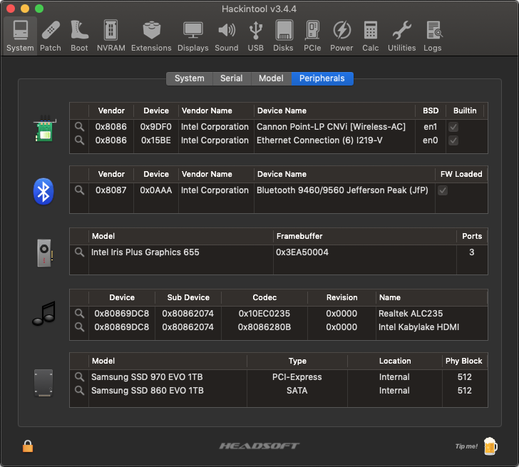

## Intel Iris Plus Graphics 655 Properties

The `AAPL,ig-platform-id` property set to `0x3EA50004` is used for **WhateverGreen** to successfully enable acceleration on this graphics device [[8086:3ea5]](http://pci-ids.ucw.cz/read/PC/8086/3ea5). This ID represents the following properties and connectors:

| Properties             | Value(s)                               |
| ---------------------- | -------------------------------------- |
| Platform ID            | `0x3EA50004` → `0400A53E` → `BAClPg==` |
| Device ID              | `0x3EA50000` i.e. no change            |
| Mobile                 | Yes                                    |
| Stolen Memory          | 57 MB                                  |
| Framebuffer Memory     | 0 MB                                   |
| Video Memory (VRAM)    | 1536 MB                                |
| Total Stolen Memory    | 58 MB                                  |
| Total Cursor Memory    | 1 MB                                   |
| Maximum Stolen Memory  | 172 MB                                 |
| Maximum Overall Memory | 173 MB                                 |
| Model Name             | Intel Iris Plus Graphics 655           |
| Camellia               | CamelliaV3 (3)                         |
| Port / Pipe Count      | 3 / 3                                  |
| Default Port Index #0  | Bus ID `0x06` Pipe `8`  Connector LVDS |
| Default Port Index #1  | Bus ID `0x05` Pipe `9`  Connector DP   |
| Default Port Index #2  | Bus ID `0x04` Pipe `10` Connector DP   |

Read more at [Intel® HD Graphics FAQs](https://github.com/acidanthera/WhateverGreen/blob/master/Manual/FAQ.IntelHD.en.md) on the **WhateverGreen** repository.

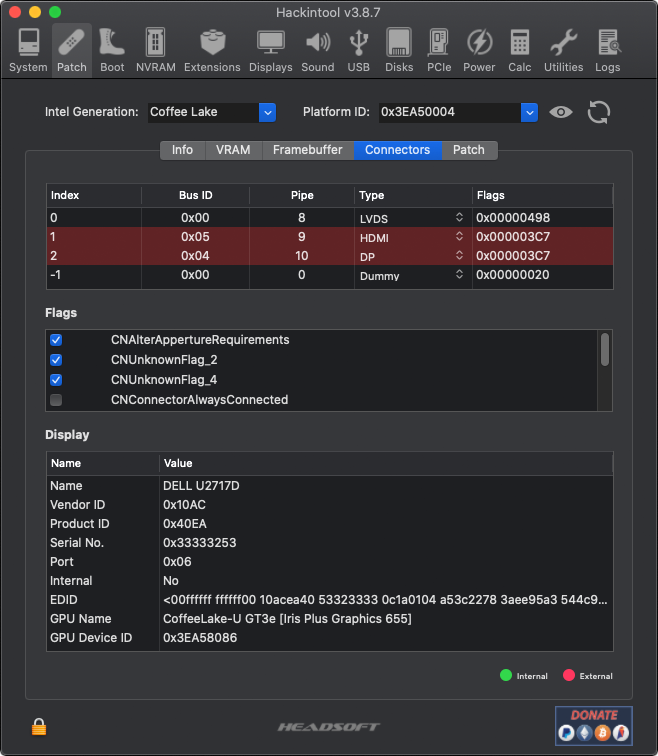

## USB Port Mapping on NUC Chassis

| USB 2.0 Port Name | USB 3.0 Port Name | Hardware Location  | Controller     |
| ----------------- | ----------------- | ------------------ | -------------- |
| HS01              | SS01              | Front RIGHT socket | Primary XHCI   |
| HS02              | SS02              | Front LEFT socket  | Primary XHCI   |
| HS03              | SS03              | Rear BOTTOM socket | Primary XHCI   |
| HS04              | SS04              | Rear TOP socket    | Primary XHCI   |
| HS10              | N/A               | Internal BTLE port | Primary XHCI   |
| HS01              | SS01              | Rear USB-C socket  | Secondary XHCI |

The above active and working USB ports are listed in Hackintool while the two *internal* (USB 2.0) headers and **Consumer IR** are all _disabled_ in [BIOS](BIOS/) and **all unused or non-referenced USB ports** are removed. In any other situation, ports such as HS05, HS06, HS07, HS08, HS09, USR1, USR2, SS05 and SS06 may be listed. All ports above are defined in `USBPorts.kext` according to their _electrical_ connector.

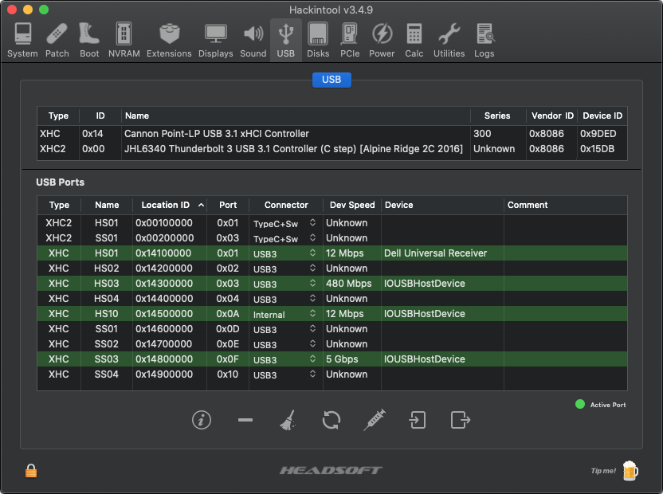

## CPU Fan Reading Support

Support for the NUC's embedded chipset **ITE IT8987E-VG** has been added in [VirtualSMC](https://github.com/acidanthera/VirtualSMC/releases) (and more specifically `SMCSuperIO.kext`) since version 1.2.2 thanks to its developers. This is achieved by injecting the needed property `<key>ec-device</key>` and the correct identifier that corresponds to the NUC's model/generation own **LPC Controller** device (see [here](https://github.com/acidanthera/VirtualSMC/blob/master/Docs/EmbeddedControllers.md)). For this NUC, the value is `<string>Intel_EC_V8</string>` thus enabling CPU fan readings in any monitoring tool.

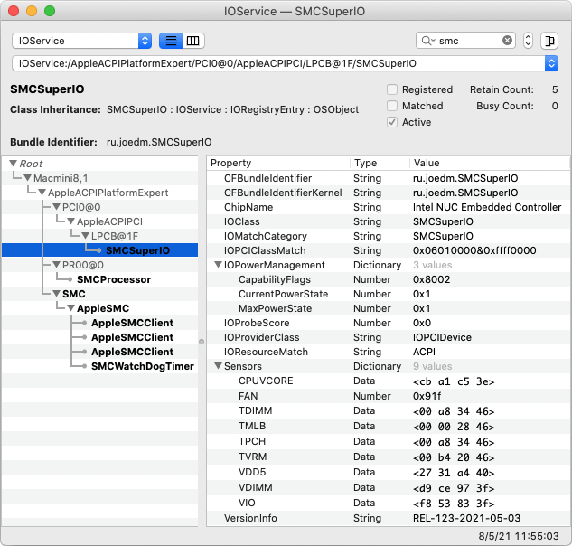

## Wireless Connectivity

The embedded 802.11ac wireless 9560 chipset [[8086:9df0]](http://pci-ids.ucw.cz/read/PC/8086/9df0) has been working without issues with [itlwm](https://github.com/OpenIntelWireless/itlwm) since Mojave. The controller can be enabled in BIOS, and for aesthetic reasons, can be renamed from `Device (CNVW)` to `(WLAN)` via OpenCore patching. As for the embedded BTLE module, Intel reports it being a Bluetooth 5.1 device, which works in _most_ cases with [IntelBluetoothFirmware](https://github.com/OpenIntelWireless/IntelBluetoothFirmware) since Mojave, too. Both drivers can be loaded through OpenCore.

## CPU Power Management

With the injection of `SSDT-PLUG.aml` via OpenCore, we can verify that Power Management is present and active as `X86PlatformPlugin` is attached to the first CPU core `PR00` per the [Dortania Guide](https://dortania.github.io/OpenCore-Post-Install/universal/pm.html).

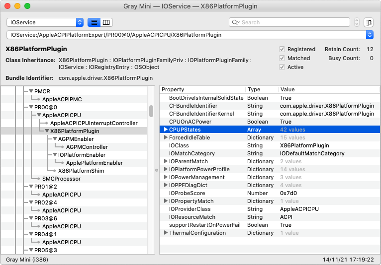

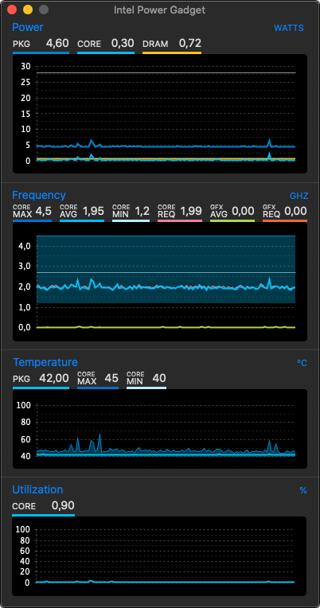

## Changes Brought About by macOS 12 and later

MacOS 12.x _Monterey_ has brought an important change in OpenCore configuration for BTLE, namely the required removal of **IntelBluetoothInjector.kext** and its replacement by **BlueToolFixup.kext** found inside [BrcmPatchRAM](https://github.com/acidanthera/BrcmPatchRAM) package. The main **IntelBluetoothFirmware.kext** remains active and must still be loaded, as done previously.

:warning: From version 2.2.0 of [IntelBluetoothFirmware](https://github.com/OpenIntelWireless/IntelBluetoothFirmware/releases) onwards, there is a new kext **IntelBTPatcher.kext** included that the developers recommend loading as it fixes a bug in Apple's _Monterey_ re-written Bluetooth stack. For more details read [here](https://openintelwireless.github.io/IntelBluetoothFirmware/FAQ.html#what-is-intelbtpatcher-trying-to-fix).

There is also a distinct version of [AirportItlwm.kext](https://github.com/OpenIntelWireless/itlwm/releases) compiled for _Monterey_ only that has to be installed, replacing the Big Sur version of the kext _without_ any OpenCore configuration changes, however.

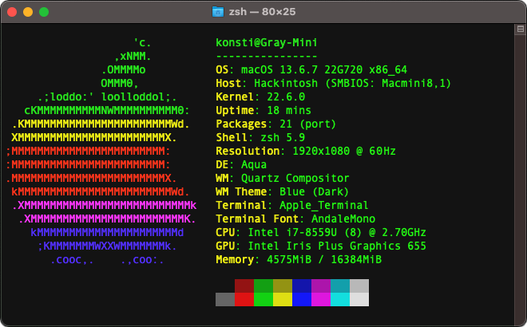

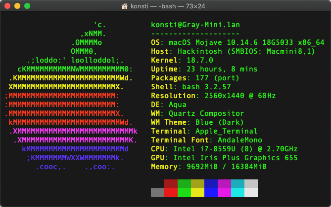

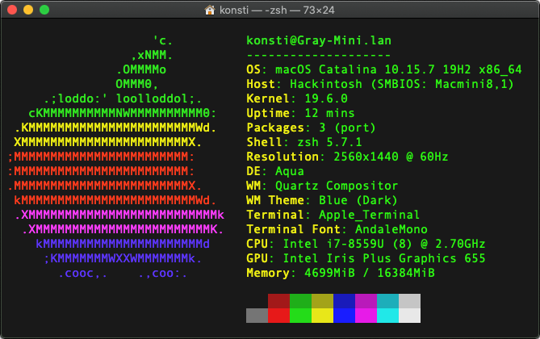

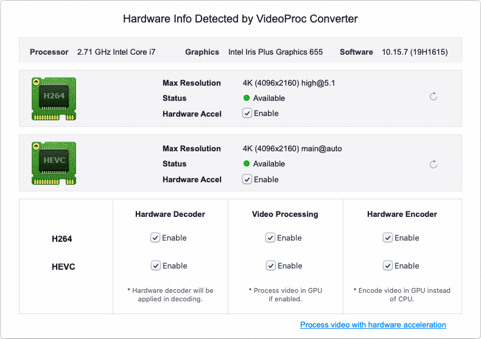

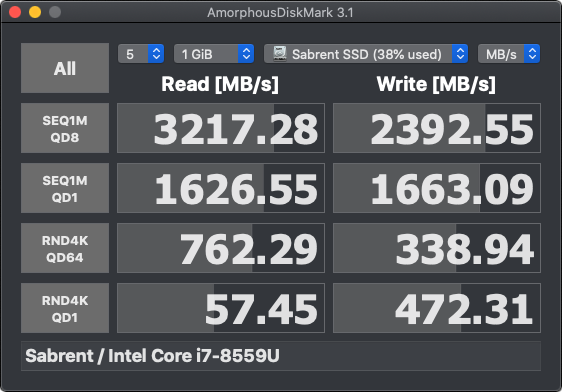
